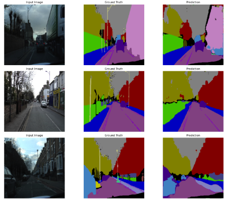
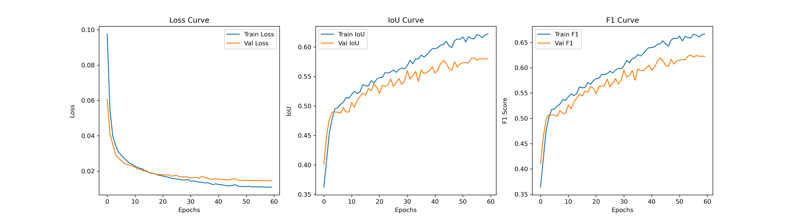

# Semantic Segmentation of Road Scenes


---



## Project Overview
This project implements **semantic segmentation** of road scenes, classifying each pixel into semantic classes. Semantic segmentation is essential for autonomous driving and scene understanding. 

The model used is **U-Net with a ResNet50 encoder pretrained on ImageNet**, trained on the **CamVid dataset** with 32 semantic classes.

---

## Key Features
- Implemented **U-Net** with **ResNet50 encoder** pretrained on ImageNet.
- Built a **custom data generator** for efficient batch loading, augmentation, and one-hot encoding.
- Achieved **IoU: 0.6211, F1: 0.6562** on CamVid test set.
- Automated training with **Early Stopping, LR Scheduling, and Model Checkpointing**.
- Generated **training curves and sample prediction visualizations** for model interpretability.

---

## Dataset Overview
- **Name:** CamVid (Cambridge-driving Labeled Video Database)
- **Source:** Kaggle
- **Link:** [CamVid Dataset](https://www.kaggle.com/datasets/carlolepelaars/camvid)
- **Classes:** 32 semantic classes

> **Note:** You may need to create a Kaggle account and accept terms to download the dataset.

---

## Tools & Technologies
- **Languages:** Python
- **Frameworks/Libraries:**
  - TensorFlow / Keras
  - segmentation_models
  - OpenCV
  - Albumentations
  - Numpy, pandas, Scikit-learn
  - Matplotlib

---

## Project Structure

```
    road-scene-segmentation/
    │
    ├── assets/
    │   ├── training_curves.png
    │   └── predictions.png
    ├── CamVid/
    │   ├── test/
    │   ├── test_labels/
    │   ├── val/
    │   └── ...
    ├── environment.yml
    ├── README.md
    ├── requirements.txt
    ├── road_scene_segmentation.ipynb
    ├── unet_resnet50.keras
    └── unet_resnet50.weights.h5
```

---

## Workflow
1. **Data Preparation**
   - Load images & masks
   - Convert RGB color to class indices
   - Apply augmentations using albumentations (resize, flips, brightness, rotations, noise)
     
2. **Custom Data Generator**
   - Efficient batch loading with augmentation
   - One-hot encoded masks
     
3. **Model**
   - U-Net with a ResNet50 backbone
   - Loss: `Categorical CrossEntropy + Focal Loss`
   - Metrics: IoU, F1-score
     
4. **Training**
   - Early stopping
   - Learning rate reduction on plateau
   - Model checkpointing
     
5. **Evaluation**
   - Metrics (IoU, F1, loss)
   - Training curves visualization
   - Prediction visualization

---

## Model Performance
| Metric | Score |
| --- | --- |
| IoU | 0.6211 |
| F1 Score | 0.6562 |
| Test Loss | 0.0180 |

### Training curves
Loss, IoU and F1-score progression across epochs:


### Sample Predictions
Input image vs. Ground Truth vs. Model Prediction:


---

## How to Run

### 1. Clone the Repository
```bash
git clone https://github.com/Dhanvika27/road-scene-segmentation.git
cd road-scene-segmentation
```
    
### 2. Create & Activate Virtual Environment
If using a virtual environment (**recommended with pip**):

```bash
# Create environment
python -m venv venv

# Activate environment (macOS/Linux)
source venv/bin/activate

# Activate environment (Windows)
venv\Scripts\activate
```

### 3. Install Dependencies
- **Using pip:**
```bash
pip install -r requirements.txt
```

- **Using conda:**
```bash
conda env create -f environment.yml
conda activate semantic-seg
```
       
> **Note:** Use either `pip` OR `conda` not both to avoid environment conflicts.

### 4. Prepare Dataset
Download the CamVid dataset from Kaggle and place it in the following structure:

```
    CamVid/
    │
    ├── train/
    ├── train_labels/
    ├── val/
    ├── val_labels/
    ├── test/
    ├── test_labels/
    └── class_dict.csv
```

### 5. Run the Project
```bash
jupyter notebook road_scene_segmentation.ipynb
```

---

## Saved Model
- Final trained model:
```
unet_resnet50.keras
```

- Best weights:
```
unet_resnet50.weights.h5
```

Load model:

```python
from tensorflow.keras.models import load_model
import segmentation_models as sm

model = load_model(
    "unet_resnet50.keras",
    custom_objects={
        "CategoricalCELoss": sm.losses.CategoricalCELoss(),
        "CategoricalFocalLoss": sm.losses.CategoricalFocalLoss(),
        "iou_score": sm.metrics.IOUScore(threshold=0.5),
        "f1-score": sm.metrics.FScore(threshold=0.5)
    }
)
```

---

## Conclusion
This project demonstrates the effectiveness of U-Net with a ResNet50 backbone for road scene segmentation on the CamVid dataset. The model achieves a strong balance between accuracy and efficiency, making it suitable for real-world applications such as autonomous driving and advanced driver assistance systems (ADAS).

> **Note:** Training was performed on CPU due to hardware constraints.
> 
> ResNet50 was chosen as the backbone due to its proven feature extraction capabilities, wide compability, and strong performance across computer vision tasks.

---

## License
This project is released under the [MIT License](LICENSE). You are free to use, modify, and distribute it with proper attribution.
